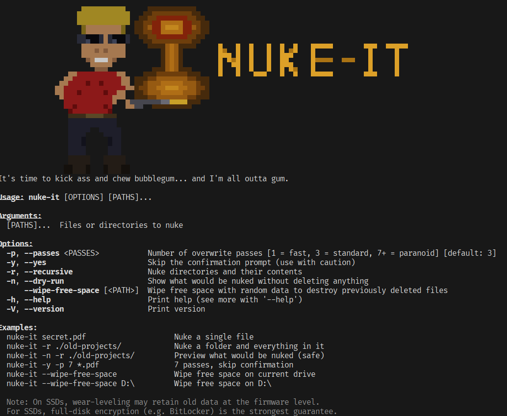

# NUKE-IT

> *"It's time to kick ass and chew bubblegum... and I'm all outta gum."*



A file shredder that doesn't just delete your files - it **nukes them from orbit**. Because moving to the recycle bin is for people who still believe in second chances.

## What It Does

`nuke-it` overwrites your files with multiple passes of random data, ones, and zeros, scrambles the filename, then deletes the remains. The original data cannot be recovered with file-recovery tools. Gone. Atomized. Rest in pieces.

## Install

```bash
cargo install nuke-it
```

## Usage

```
nuke-it secret.pdf                    Nuke a single file
nuke-it -r ./old-projects/            Nuke a folder and everything in it
nuke-it -n -r ./old-projects/         Preview what would be nuked (safe)
nuke-it -y -p 7 *.pdf                 7 passes, skip confirmation
nuke-it --wipe-free-space             Wipe free space on current drive
nuke-it --wipe-free-space D:\         Wipe free space on D:\
```

## Options

| Flag | What it does |
|---|---|
| `-p, --passes <N>` | Number of overwrite passes. 1 = fast, 3 = standard (default), 7+ = paranoid |
| `-y, --yes` | Skip confirmation. For people who live dangerously |
| `-r, --recursive` | Nuke directories and everything inside |
| `-n, --dry-run` | See what would be destroyed without actually destroying it. Coward mode |
| `--wipe-free-space [PATH]` | Fill free disk space with random data to obliterate previously deleted files |

## How It Works

For each file:

1. **Overwrite** the contents with alternating passes of random data, `0xFF`, and `0x00`
2. **Final pass** of random data (because overkill is underrated)
3. **Scramble** the filename to a random string (so the directory entry forgets it ever existed)
4. **Delete** whatever's left
5. Drop a one-liner like a true action hero

For `--wipe-free-space`: creates a temp file that grows until the drive is completely full of random data, then deletes it. Previously deleted files that were just "removed from the index" are now buried under megabytes of noise.

## SSD Disclaimer

On SSDs, wear-leveling means the firmware might retain old data in remapped blocks that no software can touch. For SSDs, full-disk encryption (BitLocker, LUKS, FileVault) is the strongest guarantee. `nuke-it` still works great on HDDs, USB drives, and for making you feel powerful.

## Built With

- Rust (because if you're going to destroy things, do it with zero-cost abstractions)
- [clap](https://crates.io/crates/clap) for CLI parsing
- [indicatif](https://crates.io/crates/indicatif) for progress bars
- [rand](https://crates.io/crates/rand) for the chaos
- Duke Nukem energy for the vibes

## License

Do whatever you want with it. Your files certainly won't be doing anything anymore.
